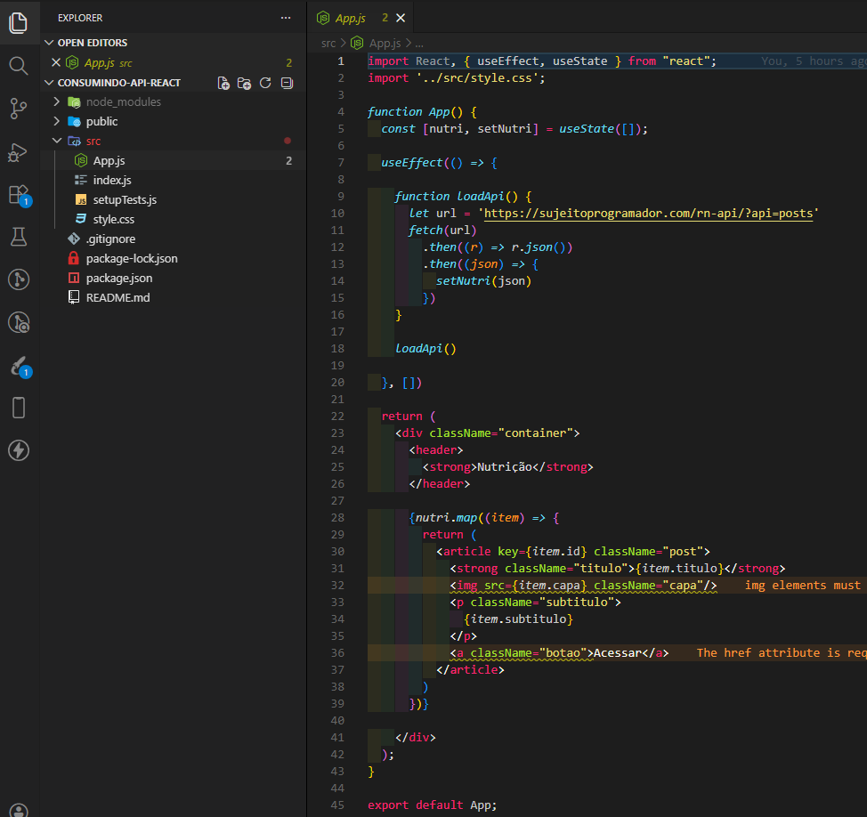

# Evoluindo App - Remaster do Projeto de Consumo de API com React

Projeto originalmente criado em uma fase anterior dos meus estudos e agora remasterizado com uma abordagem mais madura de arquitetura, organização e tipagem.

Esta versão representa a evolução do meu processo: apliquei conceitos que aprendi desde a primeira implementação e refatorei a base para ficar mais escalável, legível e previsível.

## Sobre o Projeto

A aplicação consome uma API pública de posts sobre nutrição e exibe os conteúdos em cards, com destaque para:

- listagem dinâmica de dados vindos da API
- marcação de favoritos na interface
- estrutura baseada em componentes reutilizáveis
- separação por páginas para facilitar crescimento futuro

## O Que Foi Refatorado

### 1. Migração para TypeScript

O projeto foi atualizado para TypeScript para garantir mais segurança no desenvolvimento e melhor experiência de manutenção.

Principais ganhos:

- redução de erros em tempo de execução
- autocomplete e navegação melhores no editor
- contratos explícitos entre componentes e serviços

### 2. Criação de tipos para contrato da API

Foi criado um contrato de dados centralizado para a resposta da API:

- interface ApiResponse em src/types/apiContract.ts
- serviço de API retornando Promise<ApiResponse[]>
- estado do React tipado com useState<ApiResponse[]>

Com isso, o consumo de dados ficou padronizado e mais confiável.

### 3. Estilização com Tailwind CSS

Foi aplicada estilização utilitária com Tailwind, priorizando produtividade e consistência visual:

- classes utilitárias direto nos componentes
- layout responsivo com breakpoints
- customização simples e rápida sem dependência de CSS extenso por componente

### 4. Organização da arquitetura de pastas

A estrutura foi organizada por responsabilidades para facilitar leitura e evolução:

- components: elementos reutilizáveis de UI
- pages: telas e fluxos da aplicação
- services: regras de integração com API
- types: contratos e declarações globais

### 5. Separação em componentes e página

A aplicação foi dividida em blocos mais coesos:

- Header: cabeçalho da aplicação
- Card: container visual reutilizável
- Home: página principal com regra de listagem e favoritos

Isso reduziu acoplamento e melhorou a clareza da regra de negócio.

## Estrutura de Pastas

```text
src/
	App.tsx
	index.tsx
	style.css
	components/
		Card/
			index.tsx
		Header/
			index.tsx
	pages/
		Home/
			index.tsx
	services/
		api.ts
	types/
		apiContract.ts
		global.d.ts
```

## Tecnologias Utilizadas

- React 19
- TypeScript
- Tailwind CSS
- Create React App (base do setup)
- Testing Library + Jest

## Como Executar o Projeto

### Pré-requisitos

- Node.js 18 ou superior
- npm

### Instalação

```bash
npm install
```

### Ambiente de desenvolvimento

```bash
npm start
```

A aplicação ficará disponível em http://localhost:3000.

### Rodar testes

```bash
npm test
```

### Gerar build de produção

```bash
npm run build
```

## Review Geral da Refatoração

### Pontos fortes

- Adoção de TypeScript com contrato explícito da API.
- Estrutura de pastas mais profissional e orientada a responsabilidade.
- Componentização da interface, facilitando reutilização.
- Uso de Tailwind para acelerar o desenvolvimento visual.
- Código mais limpo em comparação ao padrão inicial gerado automaticamente.


## Comparativo com o Projeto Antigo

<p align="center">
	
</p>

## Próximos Passos que pretendo realizar

- tratar estados de carregamento e erro com feedback visual para usuário
- persistir favoritos em localStorage
- adicionar testes de componentes e testes do serviço de API
- implementar paginação ou filtros por categoria
- aplicar fallback de imagem para casos de erro no carregamento

## Conclusão

Este projeto é um marco da minha evolução técnica: saiu de uma versão antiga e foi remasterizado com práticas modernas de front-end, foco em organização e base preparada para escalar.

Mais do que uma refatoração visual, foi uma melhoria estrutural de arquitetura, tipagem e manutenção.
